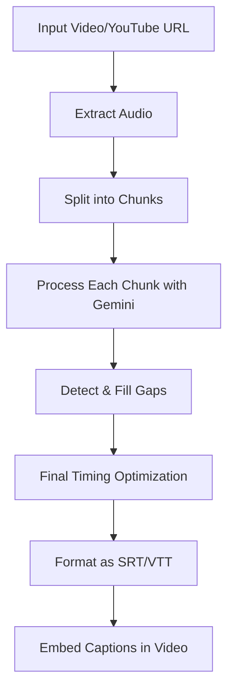
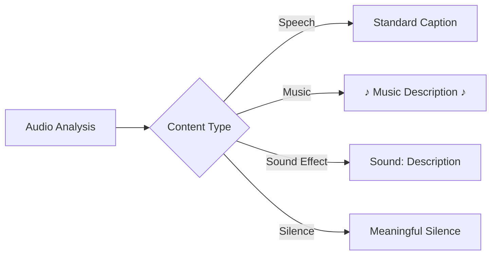
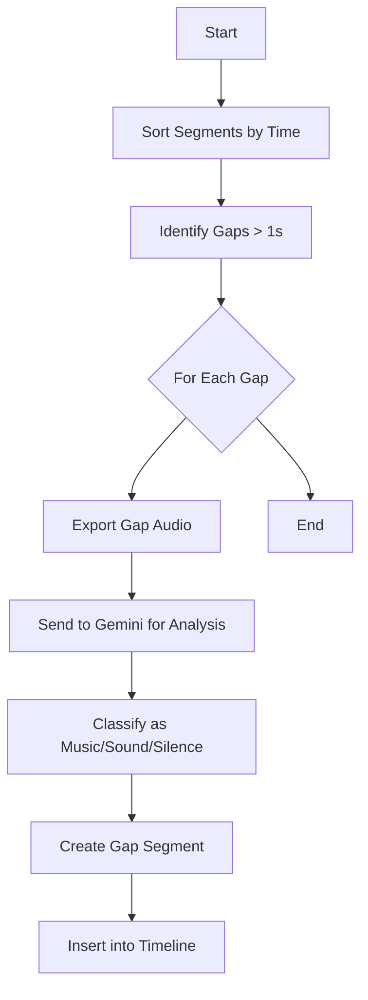
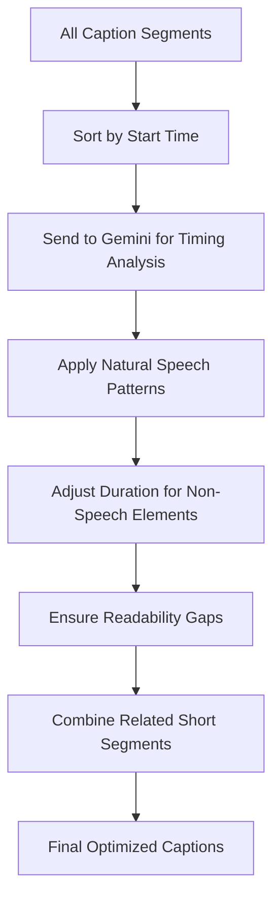
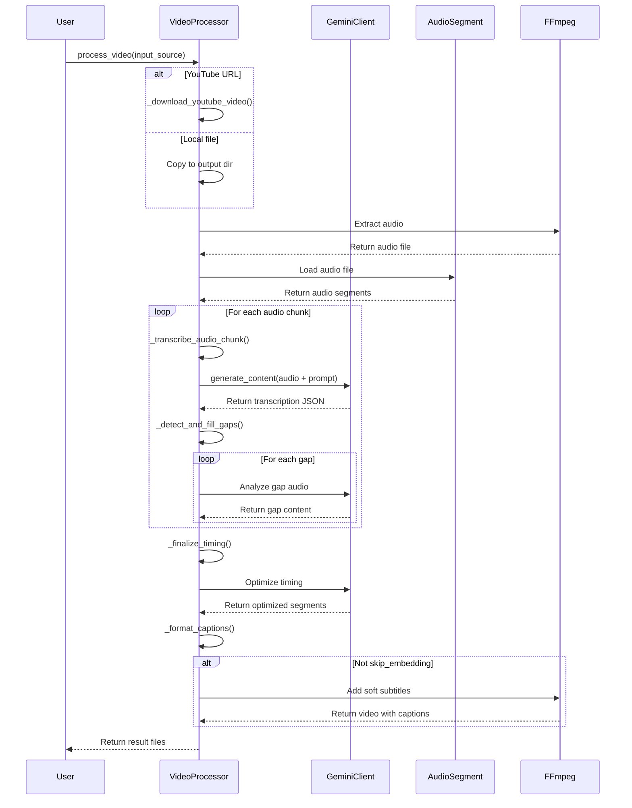

# Advanced Audio Transcription and Captioning System

A powerful system for creating high-quality captions for videos, TV shows, videocasts, and webnovels using Google's Gemini AI models. This system identifies not only spoken content but also music, sound effects, and meaningful silence to provide a complete audio experience for viewers.

## Overview

This system uses Google's Gemini multimodal AI models to:

1. Automatically transcribe speech from videos
2. Identify and label non-speech audio elements (music, sounds, silence)
3. Generate properly formatted captions with accurate timing
4. Detect and fill gaps in audio segments
5. Optimize caption timing for the best viewer experience
6. Embed captions as soft subtitles in videos

## How It Works

The system processes videos through several stages:



### Caption Type Handling

The system identifies and formats different types of audio content:



### Gap Analysis Process

To ensure no important audio cues are missed:



### Timing Optimization

The final stage ensures optimal caption timing:



### Sequence Diagram

The following sequence diagram illustrates the interactions between different components of the system:



## Installation

### Prerequisites

- Python 3.7 or higher
- Google Cloud project with Vertex AI API enabled
- ffmpeg (for audio extraction and subtitle embedding)

### Setup

1. Clone the repository
2. Install dependencies:
   ```
   pip install -r requirements.txt
   ```
3. Set up Google Cloud credentials
   ```
   export GOOGLE_APPLICATION_CREDENTIALS=/path/to/your/credentials.json
   ```

## Usage

Basic usage:

```bash
python process_video_with_captions.py "https://www.youtube.com/watch?v=VIDEO_ID"
```

### Options

```
-o OUTPUT_DIR   Custom output directory
-f {srt,vtt}    Caption format (default: srt)
-p PROJECT      Google Cloud Project ID
-c CHUNK_SIZE   Size of audio chunks in seconds (default: 30)
--skip-captions Skip caption generation (use existing caption file)
--skip-embedding Skip embedding captions (just generate caption file)
```

## Key Features

### Enhanced Audio Element Detection

- **Speech Recognition**: Accurately transcribes spoken content
- **Music Detection**: Identifies background music, theme songs, and musical cues
- **Sound Effect Detection**: Labels important sound effects that contribute to the content
- **Silence Recognition**: Identifies meaningful silence for dramatic effect

### Advanced Processing

- **Gap Detection**: Analyzes periods between speech segments for important audio cues
- **Timing Optimization**: Adjusts caption timing for optimal viewer experience
- **Format Support**: Generates captions in SRT and WebVTT formats
- **Soft Subtitle Embedding**: Embeds captions that can be toggled on/off

### WebVTT Enhanced Styling

The system utilizes WebVTT's styling capabilities:
- Italics for music (`<i>[♪ Upbeat jazz music ♪]</i>`)
- Bold for sound effects (`<b>[Sound: door slamming]</b>`)
- Standard formatting for silence labels

## Roadmap

### Short-term (1-3 months)

- [ ] Scene change detection for better caption timing
- [ ] Enhanced music genre identification
- [ ] Improved handling of overlapping speech and sound effects
- [ ] Support for additional output formats (ASS, TTML)

### Medium-term (3-6 months)

- [ ] Speaker identification and labeling
- [ ] Multi-language support and translation
- [ ] Customizable styling themes for different content types
- [ ] Batch processing for multiple videos

### Long-term (6+ months)

- [ ] Real-time processing for live streams
- [ ] Integration with popular video editing platforms
- [ ] Sentiment analysis for enhanced caption styling
- [ ] Accessibility optimizations (reading speed adjustment, simplified language options)
- [ ] Visual context awareness for better caption placement

## Contributing

Contributions are welcome! Please feel free to submit a Pull Request.

## License

This project is licensed under the MIT License - see the LICENSE file for details.
