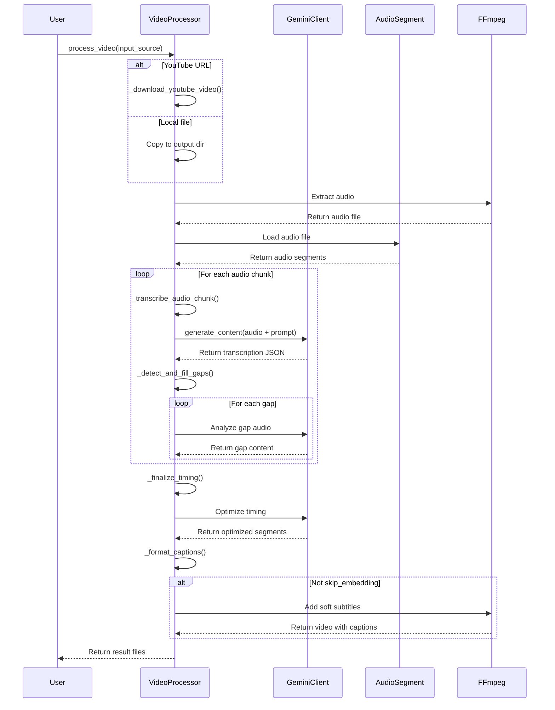

# Advanced Audio Transcription and Captioning System

A powerful system for creating high-quality captions for videos, TV shows, videocasts, and webnovels using Google's Gemini AI models. This system identifies not only spoken content but also music, sound effects, and meaningful silence to provide a complete audio experience for viewers.

## Overview

This system uses Google's Gemini multimodal AI models to:

1. Automatically transcribe speech from videos
2. Identify and label non-speech audio elements (music, sounds, silence)
3. Generate properly formatted captions with accurate timing
4. Detect and fill gaps in audio segments
5. Optimize caption timing for the best viewer experience
6. Embed captions as soft subtitles in videos

## System Architecture

The following sequence diagram illustrates the interactions between different components of the system:



## Documentation

Detailed technical documentation is available in the docs folder:

- [Process Flow](docs/process_flow.md) - The step-by-step process of audio transcription
- [Content Type Handling](docs/content_type_handling.md) - How different audio elements are identified and formatted
- [Gap Analysis](docs/gap_analysis.md) - How gaps between speech segments are analyzed
- [Timing Optimization](docs/timing_optimization.md) - How caption timing is optimized for viewing
- [Sequence Diagram](docs/sequence_diagram.md) - Detailed explanation of component interactions

## Installation

### Prerequisites

- Python 3.7 or higher
- Google Cloud project with Vertex AI API enabled
- ffmpeg (for audio extraction and subtitle embedding)

### Setup

1. Clone the repository
2. Install dependencies:
   ```
   pip install -r requirements.txt
   ```
3. Set up Google Cloud Application Default Credentials (ADC) and export your project ID
   ```
   # Configure Application Default Credentials
   gcloud auth application-default login

   # Export your Google Cloud project ID
   export GCP_PROJECT=your-project-id
   ```

## Usage

### Command Line Interface

Basic usage:

```bash
python process_video_with_captions.py "https://www.youtube.com/watch?v=VIDEO_ID"
```

#### Options

```
-o OUTPUT_DIR   Custom output directory
-f {srt,vtt}    Caption format (default: srt)
-p PROJECT      Google Cloud Project ID
-c CHUNK_SIZE   Size of audio chunks in seconds (default: 30)
--skip-captions Skip caption generation (use existing caption file)
--skip-embedding Skip embedding captions (just generate caption file)
```

### Web Interface

The system now includes a web interface that allows you to:
- Paste YouTube URLs
- Upload local video files
- View processed videos with captions in the browser

To run the web interface:

```bash
python app.py
```

Then open your browser and navigate to: `http://localhost:5000`

#### Web Interface Features

- **YouTube Processing**: Simply paste a YouTube URL and click "Process Video"
- **File Upload**: Upload videos up to 500MB (MP4, MOV, AVI, MKV formats)
- **Real-time Status Updates**: Monitor processing status in real-time
- **Integrated Video Player**: Watch processed videos with captions directly in your browser
- **Caption Format Selection**: Choose between SRT and WebVTT caption formats
- **Token Usage Statistics**: Monitor AI resource consumption with detailed token usage metrics

## Key Features

### Enhanced Audio Element Detection

- **Speech Recognition**: Accurately transcribes spoken content
- **Music Detection**: Identifies background music, theme songs, and musical cues
- **Sound Effect Detection**: Labels important sound effects that contribute to the content
- **Silence Recognition**: Identifies meaningful silence for dramatic effect

### Advanced Processing

- **Gap Detection**: Analyzes periods between speech segments for important audio cues
- **Timing Optimization**: Adjusts caption timing for optimal viewer experience
- **Format Support**: Generates captions in SRT and WebVTT formats
- **Soft Subtitle Embedding**: Embeds captions that can be toggled on/off
- **Token Usage Tracking**: Records and displays AI usage metrics for optimization

## Contributing

Contributions are welcome! Please feel free to submit a Pull Request.

## License

This project is licensed under the Apache 2.0 License - see the LICENSE file for details.
