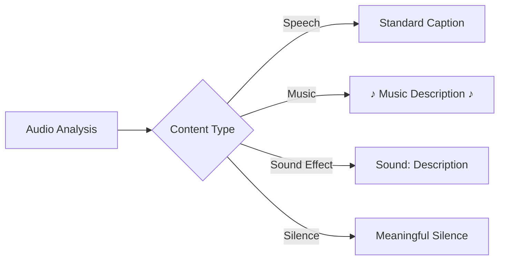

# Caption Content Type Handling

The system identifies and formats different types of audio content:

## Content Type Details

1. **Speech**: Regular dialogue is formatted as standard captions.
2. **Music**: Background music, theme songs, and musical cues are formatted with musical notes: `[♪ Upbeat jazz music ♪]`.
3. **Sound Effects**: Important sound effects are clearly labeled: `[Sound: door slamming]`.
4. **Silence**: Meaningful silence (dramatic pauses, etc.) is indicated when contextually important: `[Tense silence]`.

### WebVTT Enhanced Styling

When using WebVTT format, the system applies additional styling:
- Italics for music (`<i>[♪ Upbeat jazz music ♪]</i>`)
- Bold for sound effects (`<b>[Sound: door slamming]</b>`)
- Standard formatting for silence labels
