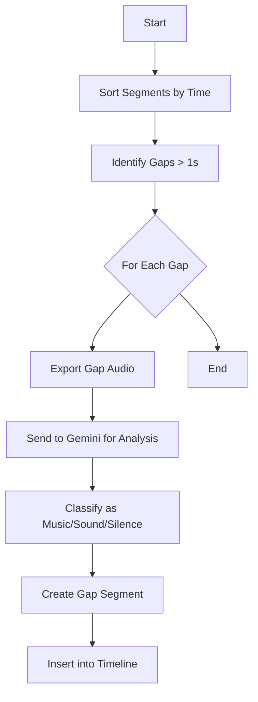

# Gap Analysis Process

To ensure no important audio cues are missed, the system analyzes gaps between detected speech segments:

## Gap Analysis Details

1. **Sort Segments by Time**: All detected segments are sorted chronologically.
2. **Identify Gaps > 1s**: Gaps larger than 1 second between speech segments are identified.
3. **Export Gap Audio**: Audio for each identified gap is extracted.
4. **Send to Gemini for Analysis**: Gap audio is sent to Gemini for analysis.
5. **Classify Content**: Gemini identifies if the gap contains music, sound effects, or meaningful silence.
6. **Create Gap Segment**: A new caption segment is created for the identified content.
7. **Insert into Timeline**: The new segment is inserted into the correct position in the caption timeline.

This process ensures that non-speech audio elements like background music, sound effects, and meaningful silence are properly represented in the captions, providing a more complete audio experience for viewers.
