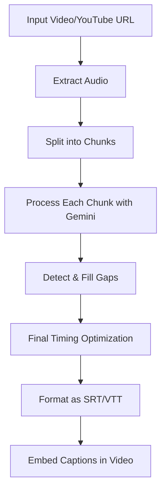

# Audio Transcription Process Flow

The system processes videos through several stages:

## Process Details

1. **Input Video/YouTube URL**: The system accepts either a local video file or a YouTube URL.
2. **Extract Audio**: Audio is extracted from the video using FFmpeg.
3. **Split into Chunks**: The audio is divided into manageable chunks (default: 30 seconds).
4. **Process Each Chunk with Gemini**: Each chunk is analyzed using Google's Gemini multimodal model.
5. **Detect & Fill Gaps**: Gaps between detected speech segments are analyzed for music, sounds, or silence.
6. **Final Timing Optimization**: All segments are sent to Gemini for timing optimization.
7. **Format as SRT/VTT**: The optimized segments are formatted into the chosen caption format.
8. **Embed Captions in Video**: Captions are embedded as soft subtitles in the video.
