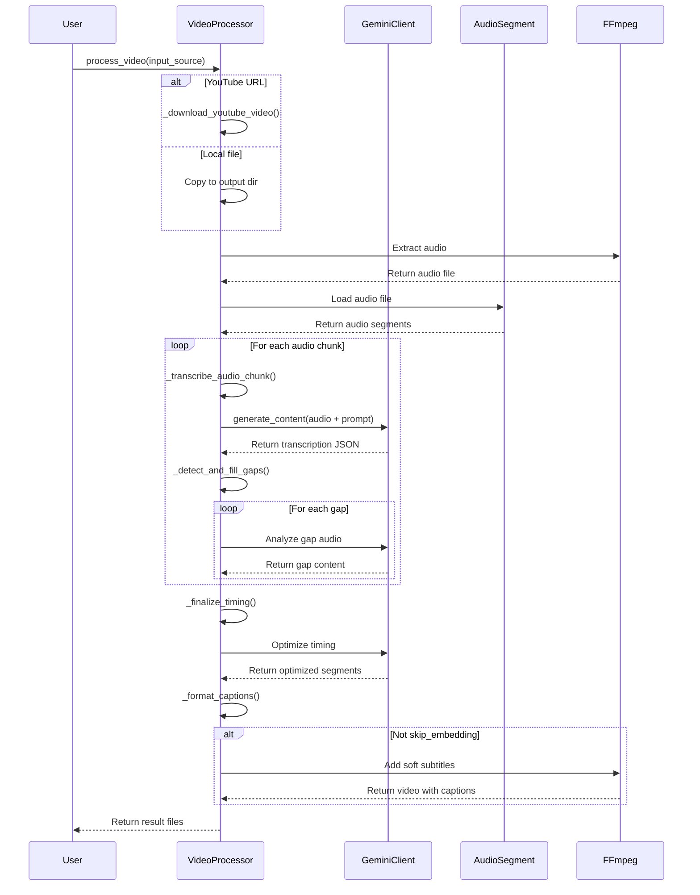

# System Interaction Sequence Diagram

The following sequence diagram illustrates the interactions between different components of the system:

## Sequence Diagram Details

The sequence diagram shows the temporal flow of operations and interactions between system components:

1. **User Interaction**: The process begins when the user calls the `process_video()` method.
2. **Input Handling**: 
   - For YouTube URLs, the system downloads the video
   - For local files, it copies the file to the output directory
3. **Audio Extraction**: FFmpeg extracts the audio from the video file
4. **Audio Processing**: The audio is loaded and split into chunks
5. **Transcription Loop**: For each audio chunk:
   - The chunk is sent to Gemini for transcription
   - Gaps in the transcription are identified and analyzed
6. **Final Processing**:
   - All segments are sent to Gemini for timing optimization
   - Captions are formatted in the chosen format (SRT/VTT)
7. **Embedding**: If not skipped, captions are embedded as soft subtitles
8. **Result**: The output files are returned to the user

This diagram reveals the multiple interactions with Gemini's AI models, showing how the system leverages AI at multiple stages of the captioning process for transcription, gap analysis, and timing optimization.
