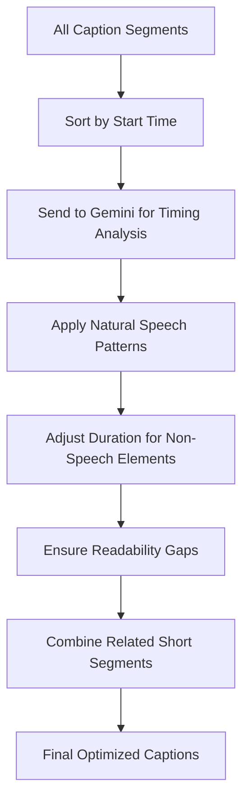

# Caption Timing Optimization

The final stage ensures optimal caption timing for viewer readability:

## Timing Optimization Details

1. **Sort by Start Time**: All caption segments are sorted chronologically.
2. **Send to Gemini for Timing Analysis**: The complete set of segments is sent to Gemini for holistic optimization.
3. **Apply Natural Speech Patterns**: Speaking cadence and sentence structure are considered for proper timing.
4. **Adjust Duration for Non-Speech Elements**: Music and sound elements receive appropriate durations.
5. **Ensure Readability Gaps**: Proper gaps are inserted between captions for readability.
6. **Combine Related Short Segments**: Very short segments that form part of the same sentence are merged.
7. **Final Optimized Captions**: The result is a set of captions with timing optimized for the best viewer experience.

This optimization step is crucial for ensuring that captions aren't displayed too quickly to read or too slowly to match the audio. It also considers natural speech patterns and sentence breaks to make the captions feel more natural and easier to follow.
